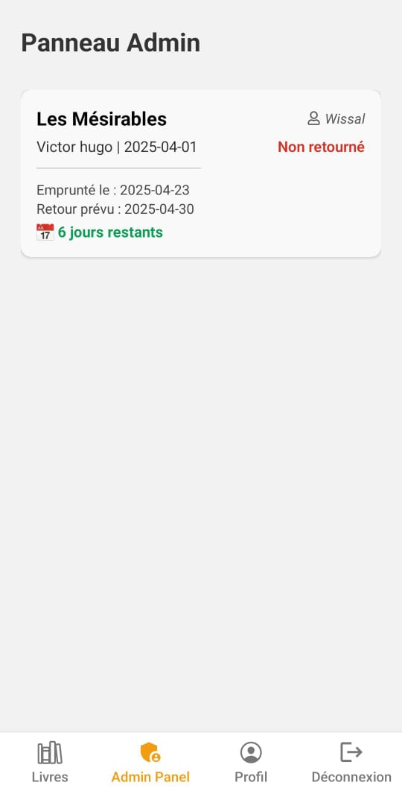
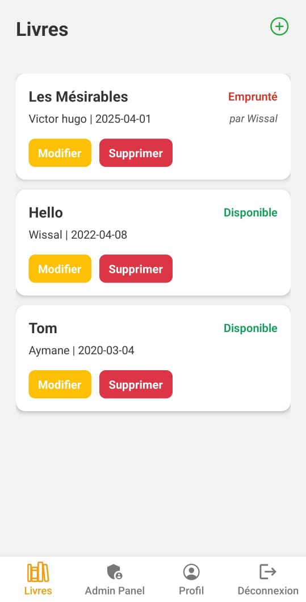

# 📚 LibraryApp

LibraryApp est une application de gestion de bibliothèque permettant aux utilisateurs d’emprunter et de retourner des livres, et aux administrateurs de gérer les emprunts. Elle propose une interface mobile développée en React Native et un backend robuste en Django REST Framework, avec une base de données MySQL.

## 🚀 Fonctionnalités

### 👤 Authentification
- Inscription et connexion sécurisées avec JWT.
- Gestion de rôles (utilisateur / administrateur).
- Modification du mot de passe via une popup.

### 📖 Gestion des Livres
- Ajout, modification et suppression de livres (admin).
- Consultation des livres disponibles.
- Statut visuel : **Disponible** / **Emprunté**.

### 📝 Emprunts
- Emprunt de livres par les utilisateurs.
- Retour des livres avec date de retour affichée.
- Délai restant avant retour affiché dynamiquement.
- Affichage des emprunts dans l’onglet **Mes emprunts**.
- Panneau Admin avec la liste complète des emprunts.

### 👤 Profil Utilisateur
- Affichage et édition des informations personnelles.
- Rôle affiché avec badge.

## 📷 Captures d’écran

| Connexion | Admin Panel | 
|----------|-------------|
|  |  |
| Livres (Admin) | Profil (utilisateur) |
|  |  |

*Voir plus de captures dans le dossier `/screenshots`.*

## 🧱 Architecture du projet

```
LibraryApp/
│
├── backend/
│   ├── authentication/        # Authentification & sécurité
│   ├── library/               # Gestion des livres et emprunts
│   └── myapp/                 # Paramètres Django
│
├── frontend/LibraryApp/
│   ├── screens/               # Écrans React Native
│   ├── services/              # Appels API
│   └── App.tsx                # Point d’entrée
```

## 🛠️ Technologies utilisées

### Frontend (Mobile)
- **React Native** : Développement d’applications mobiles multiplateformes.
- **TypeScript** : Typage statique pour JavaScript.
- **Expo** : Plateforme de développement mobile rapide.
- **Axios** : Requêtes HTTP vers le backend.

### Backend
- **Django** : Framework web Python robuste.
- **Django REST Framework** : Création d’APIs RESTful.
- **MySQL** : Base de données relationnelle.

### Authentification
- **JWT** : JSON Web Tokens pour la gestion sécurisée des sessions.

## ⚙️ Instructions de démarrage

1. Cloner le repo :
```bash
git clone https://github.com/WissalEnnajah/EmpruntLivre.git
```
### 🖥️ Backend
   ```bash
   cd backend
   ```
2. Installer les dépendances :
   ```bash
   pip install -r requirements.txt
   ```
3. Configurer votre `.env` et lancer :
   ```bash
   python manage.py migrate
   python manage.py runserver
   ```

### 📱 Frontend
1. Aller dans le dossier :
   ```bash
   cd frontend/LibraryApp
   ```
2. Installer les dépendances :
   ```bash
   npm install
   ```
3. Lancer Expo :
   ```bash
   npx expo start
   ```

## 🔐 Accès admin
Par défaut :
- Nom d'utilisateur : `admin`
- Mot de passe : `admin`

## 🧩 Améliorations futures
- Notifications push pour les rappels de retour.
- Historique des emprunts.
- Système de réservation.
- Thèmes clair/sombre.

## 👨‍💻 Auteur
Projet réalisé par **Wissal Ennajah** et encadré par **Pr Mezili Toufik** dans le cadre de la Faculté des Sciences d'El Jadida.
